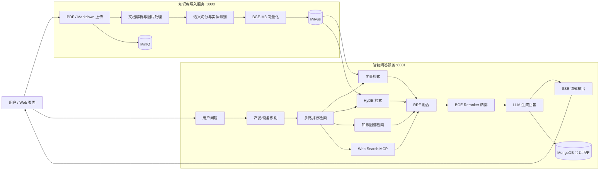

# SpecLens

面向设备说明书与产品手册的智能知识库问答系统。SpecLens 将 PDF/Markdown 文档解析、切分并写入向量数据库，在查询阶段通过多路检索、结果融合与重排，为用户生成支持流式输出的回答。

> 当前仓库是项目源码与本地运行版本。完整体验需要自行配置大语言模型、Embedding/Reranker 模型以及 Milvus、MongoDB、MinIO 等外部服务。

## 项目亮点

- **文档处理流水线**：支持 PDF/Markdown 导入，完成文档解析、图片处理、语义切分、实体识别、向量化和入库。
- **多路召回**：并行执行向量检索、HyDE 检索、知识图谱检索和 Web Search MCP 检索。
- **检索增强生成**：使用 RRF（Reciprocal Rank Fusion）融合召回结果，再通过 BGE Reranker 精排后交给 LLM 生成答案。
- **流式交互**：基于 FastAPI 与 SSE 增量返回回答，并提供会话历史查询与清理接口。
- **任务可观测性**：文档导入采用后台任务执行，前端可根据 Task ID 轮询各处理节点的进度。
- **工程化配置**：模型、数据库、对象存储与日志参数统一由环境变量管理，敏感信息不进入仓库。

## 系统架构



## 核心流程

### 1. 知识库导入

```text
文件上传
  → PDF 转 Markdown（Markdown 文件可跳过）
  → Markdown 图片处理
  → 文档切分
  → 产品/设备名称识别
  → BGE-M3 Embedding
  → 写入 Milvus
```

每个文件会生成独立 Task ID，处理状态包含 `pending`、`processing`、`completed` 和 `failed`。

### 2. 智能问答

```text
设备识别
  → 向量 / HyDE / 知识图谱 / Web 多路检索
  → RRF 融合
  → BGE Reranker 精排
  → LLM 基于上下文生成答案
  → SSE 流式输出并保存会话历史
```

当设备名称不明确或知识库中没有对应设备时，流程可以直接返回澄清问题或拒答结果，避免无依据生成。

## 技术栈

| 类别 | 技术 |
| --- | --- |
| Web/API | FastAPI、Uvicorn、SSE |
| 工作流编排 | LangGraph |
| 大模型调用 | LangChain、OpenAI-compatible API |
| 文档解析 | MinerU / Magic PDF |
| Embedding | BGE-M3、FlagEmbedding |
| 检索与重排 | Milvus、HyDE、RRF、BGE Reranker |
| 数据存储 | MongoDB、MinIO |
| 工程工具 | uv、Loguru、python-dotenv |

## 目录结构

```text
SpecLens/
├─ app/
│  ├─ clients/                 # Milvus、MongoDB、MinIO 等客户端
│  ├─ conf/                    # 模型与基础设施配置
│  ├─ core/                    # 日志、Prompt 加载等公共能力
│  ├─ import_process/          # 文档导入 API、页面与 LangGraph 节点
│  ├─ query_process/           # 问答 API、页面与检索生成节点
│  ├─ lm/                      # LLM、Embedding、Reranker 封装
│  ├─ tool/                    # 模型下载工具
│  └─ utils/                   # SSE、任务状态、路径等工具
├─ prompts/                    # 提示词模板
├─ test/                       # 流程与环境测试脚本
├─ .env.example               # 环境变量模板（不包含真实密钥）
├─ pyproject.toml
└─ uv.lock
```

## 本地运行

### 环境要求

- Python 3.11+
- [uv](https://docs.astral.sh/uv/)
- Milvus
- MongoDB
- MinIO
- 可访问的 OpenAI-compatible LLM/VLM API
- BGE-M3 与 BGE Reranker 模型（GPU 可选，CPU 也可配置）
- MinerU 服务或相应文档解析环境

### 1. 安装依赖

```bash
git clone https://github.com/njdhvkjnk/SpecLens.git
cd SpecLens
uv sync
```

### 2. 配置环境变量

```bash
cp .env.example .env
```

Windows PowerShell：

```powershell
Copy-Item .env.example .env
```

根据本机环境填写 `.env`。至少需要配置以下几类参数：

- LLM/VLM：`OPENAI_API_KEY`、`OPENAI_BASE_URL`、`LLM_DEFAULT_MODEL`、`VL_MODEL`
- Embedding/Reranker：`BGE_M3_PATH`、`BGE_M3`、`BGE_DEVICE`、`BGE_RERANKER_LARGE`
- Milvus：`MILVUS_URL`、`CHUNKS_COLLECTION`、`ENTITY_NAME_COLLECTION`、`ITEM_NAME_COLLECTION`
- MongoDB：`MONGO_URL`、`MONGO_DB_NAME`
- MinIO：`MINIO_ENDPOINT`、`MINIO_ACCESS_KEY`、`MINIO_SECRET_KEY`、`MINIO_BUCKET_NAME`
- MinerU：`MINERU_BASE_URL`、`MINERU_API_TOKEN`

不要把真实 `.env`、访问令牌、数据库密码或模型服务密钥提交到 Git。

### 3. 启动文档导入服务

```bash
uv run python -m app.import_process.api.file_import_service
```

- 导入页面：<http://127.0.0.1:8000/import.html>
- Swagger：<http://127.0.0.1:8000/docs>

### 4. 启动问答服务

另开一个终端：

```bash
uv run python -m app.query_process.api.query_service
```

- 问答页面：<http://127.0.0.1:8001/chat.html>
- 健康检查：<http://127.0.0.1:8001/health>
- Swagger：<http://127.0.0.1:8001/docs>

## 主要 API

### 文档导入服务（8000）

| 方法 | 路径 | 说明 |
| --- | --- | --- |
| `GET` | `/import.html` | 文档上传页面 |
| `POST` | `/upload` | 批量上传 PDF/Markdown 并创建后台任务 |
| `GET` | `/status/{task_id}` | 查询导入任务状态与节点进度 |

### 智能问答服务（8001）

| 方法 | 路径 | 说明 |
| --- | --- | --- |
| `GET` | `/chat.html` | Web 问答页面 |
| `GET` | `/health` | 服务健康检查 |
| `POST` | `/query` | 提交问题，可选择流式或非流式模式 |
| `GET` | `/stream/{session_id}` | 订阅 SSE 回答流 |
| `GET` | `/history/{session_id}` | 查询会话历史 |
| `DELETE` | `/history/{session_id}` | 清理会话历史 |

请求示例：

```bash
curl -X POST http://127.0.0.1:8001/query \
  -H "Content-Type: application/json" \
  -d '{"query":"打印机卡纸后应该如何处理？","is_stream":false}'
```

## 建议演示流程

1. 打开文档导入页面，上传一份设备说明书。
2. 展示 Task ID 以及解析、切分、向量化、入库等节点进度。
3. 打开问答页面，输入包含具体设备型号的问题。
4. 展示多路检索、重排后的答案和相关图片信息。
5. 开启流式模式，展示 SSE 增量输出。
6. 使用同一 Session ID 连续追问，展示会话历史能力。

## 验证状态与限制

- 源码已通过 Python `compileall` 语法检查。
- 完整集成测试依赖外部模型、Milvus、MongoDB、MinIO 与 MinerU 服务，无法在未配置这些组件的环境中独立完成。
- 当前任务状态存储在进程内存中，服务重启后不会保留；生产环境可替换为 Redis 等持久化方案。
- 当前 CORS 配置与本地监听方式面向开发演示，生产部署前应限制允许来源、补充认证授权并使用反向代理。
- 原始设备手册、运行日志、处理产物、模型文件和真实环境变量均未提交到仓库。

## 项目地址

<https://github.com/njdhvkjnk/SpecLens>
